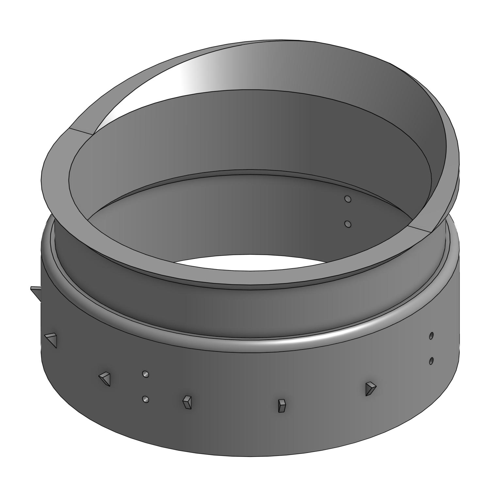
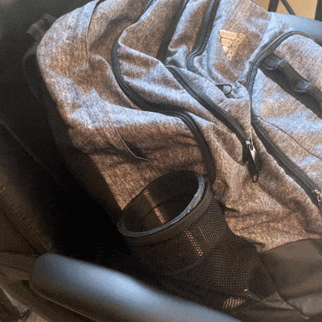

[Return Home](../../README.md)

## Backpack Cupholder Stretcher (8/2022)

### Problem:
I have a cheap Adidas backpack, but my 40oz water bottle doesn't easily fit in its elastic side pockets.

 

### Solution:
I made a plastic insert for my backpack pocket that would weaken the elastics in the pocket and eventually let the bottle fit inside with little extra effort.

(design and GIF of it in backpack while I put bottle into it.)
  

**Details:**
This was the largest functional print I had ever designed up until then, and I was worried about printing errors (which turned out to be a valid concern). It was also going to be my first attempt using PETG as the printing medium, since I bought 3 rolls of it from Microcenter with a coupon and needed to start using it.

**Challenges & Solutions:**
- **Challenge: The elastics on the backpack pocket are quite stiff** 
    - Solution: Make the insert thick and structually sound.
- **Challenge: I still need to use the pocket, even with the insert in it**
    - Solution: Make the insert have a circular cutout large enough for the water bottle to fit in, allowing it to be used as a pocket while simultaneously being stretched out.
- **Challenge: The fabric on the elastics is quite slippery** 
    - Solution: Add hooks to the outside of the insert that catch onto the fabric and keep it stuck in place.

#### Conclusions:
This worked better than I could've hoped. I used it for about 4 months, then I took it out and my bottle fit perfectly with very little effort (I can even put in in with one hand while wearing the backpack.)

However, as is probably apparent in the image, my PETG settings were correct. I printed this out, only for the top chunk to break off within a week. It had poor layer adhesion and some layer shifts, but I didn't want to use up a bunch more PETG just to make it look nicer. Instead, I spent some time afterward troubleshooting my settings using smaller prints, eventually finding success by lowering the fan speed and raising the temperature.

---

####
All associated files and images can be found [here](./)