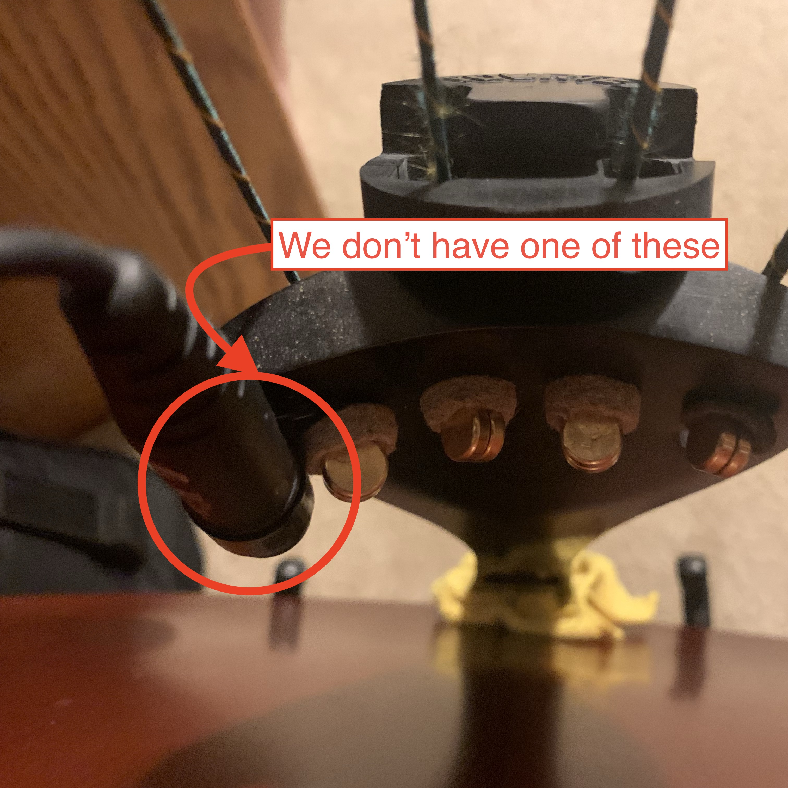
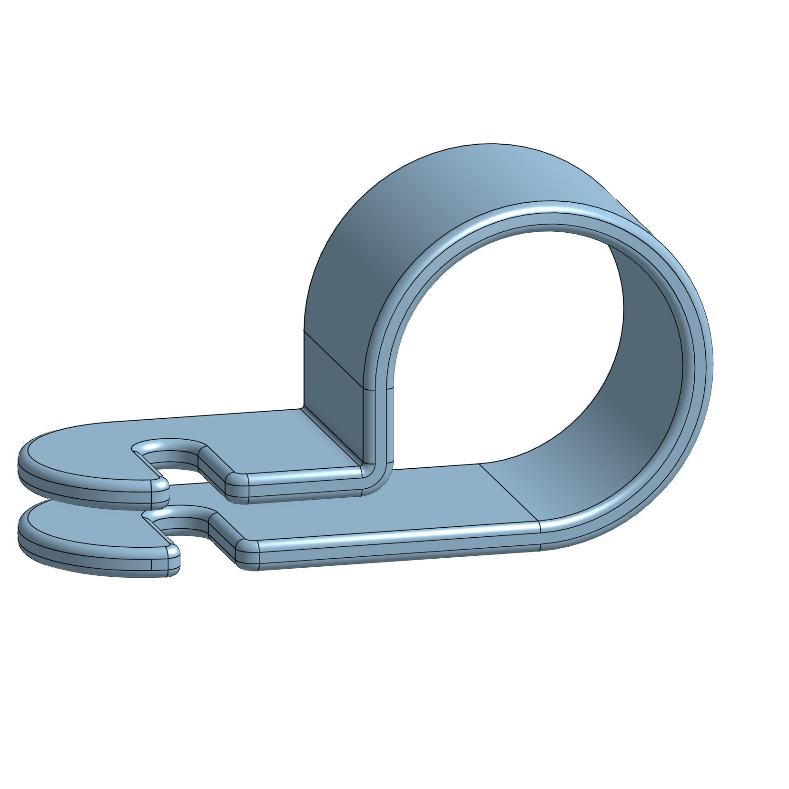
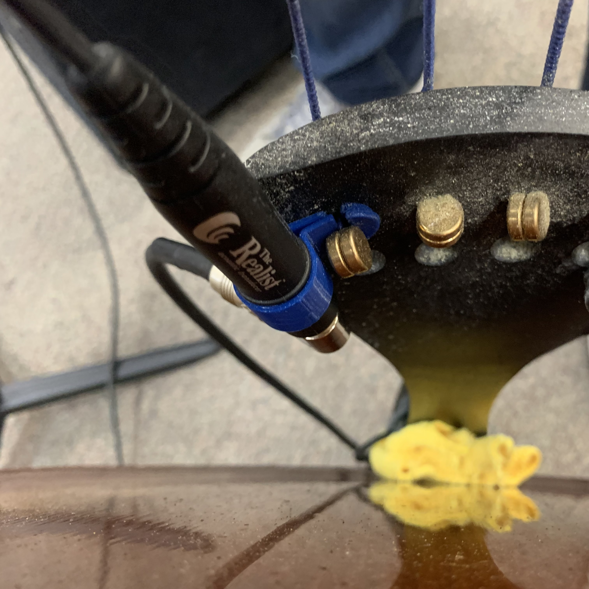

[Return Home](../../README.md)

## Bass Pickup Clip (4/2023)

### Problem:
My director purchased a pickup for the school basss that I was tasked with assembling, but it's missing the piece that secures the audio-output jack to the bass itself.

(show my bass with clip on it, have text say "we don't have this)
 

### Solution:
3D print a new audio jack holder/clip, correcting any design flaws along the way.

  

**Details:**
This is the first project I made for use in my school, and also one that sees use every single day in my Jazz Band class. 

**Challenges & Solutions:**
- **Challenge: The original clip design required removing the entire string from the instrument to thread the attachment on, but that's a bit risky with the used strings on my school's bass** 
    - Solution: Create a slit in the clip's design that allows the clip to be slid on without taking off the entire string. 
- **Challenge: The clip needs to be able to slide over ridges on the audio jack's exterior, but still needs to be held securely once in place**
    - Solution: Make the clip adaptively clamp down on the audio jack when the string is tensioned, and make the original design a bit over-sized so the pickup can slide through initially.
- **Challenge: Because I made the design of the clip clamp-like, the slit for the string is no longer lining up once the two side are squeezed together** 
    - Solution: Offset the slits from each other just the slightest amount so the slits can fit on the string both with and without tension on the clip.

#### Conclusions:
This thing works great. It's been through three school years and several bass players and it's still just as secure as it was on day one. My band director loves showing it off as a little bit of engineering that I've contributed to his program.

---
####
All associated files and images can be found [here](./)