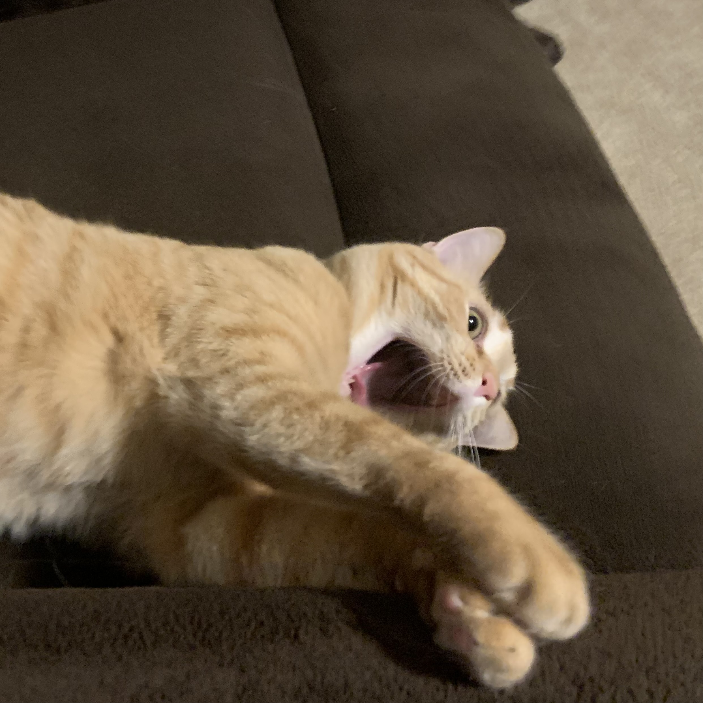
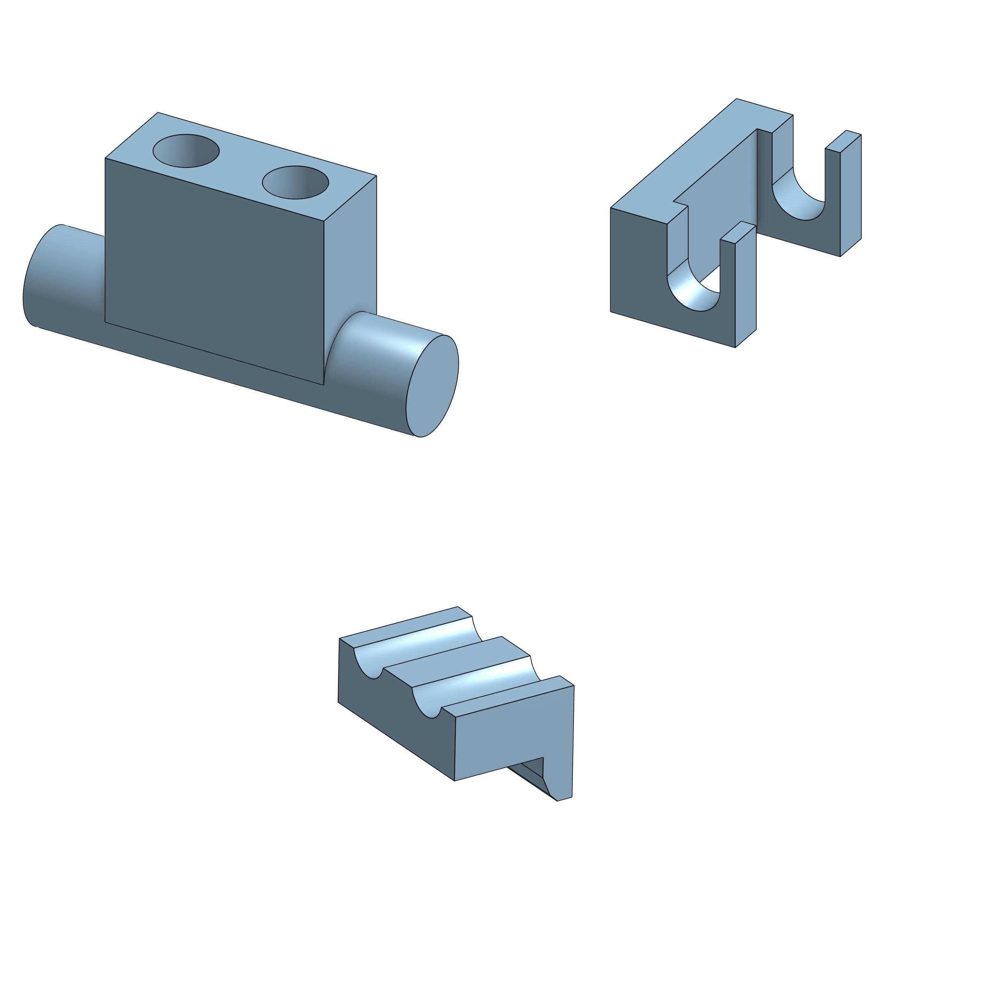
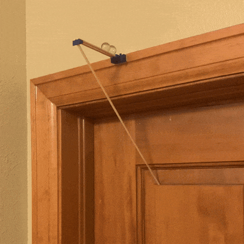
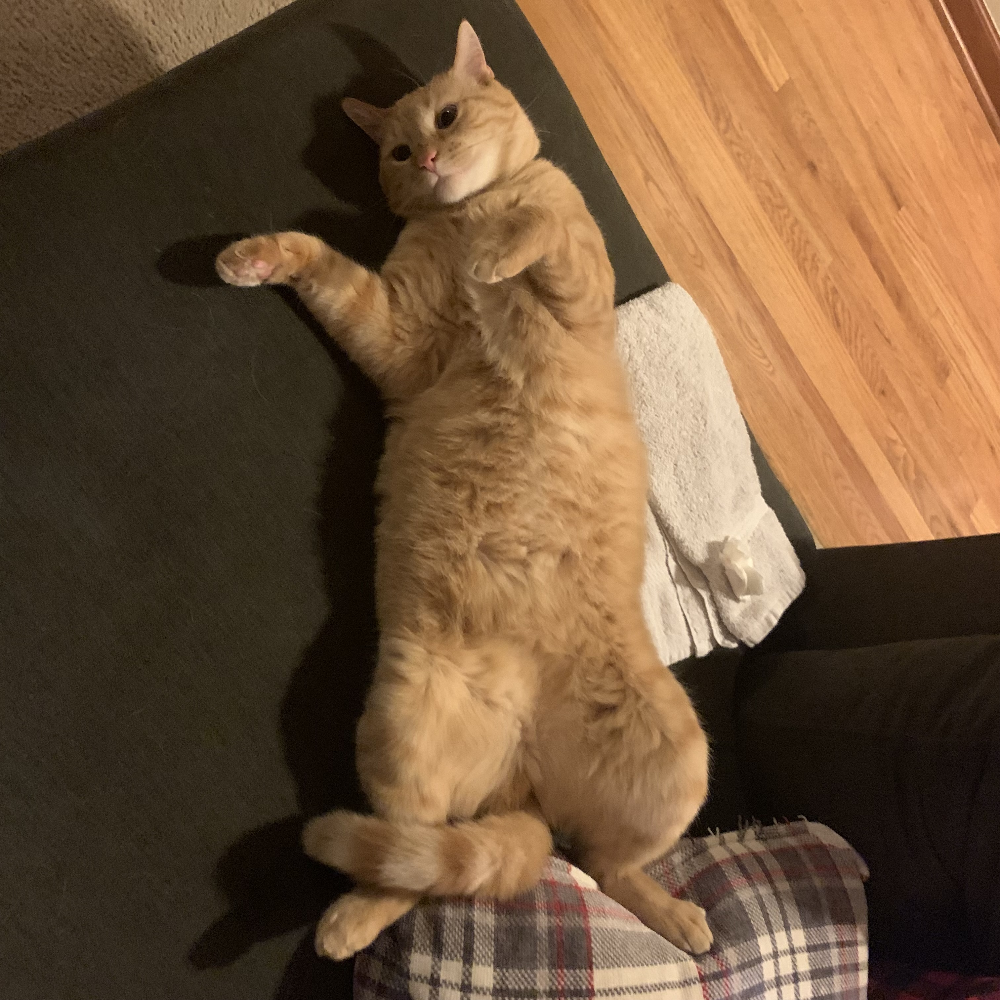
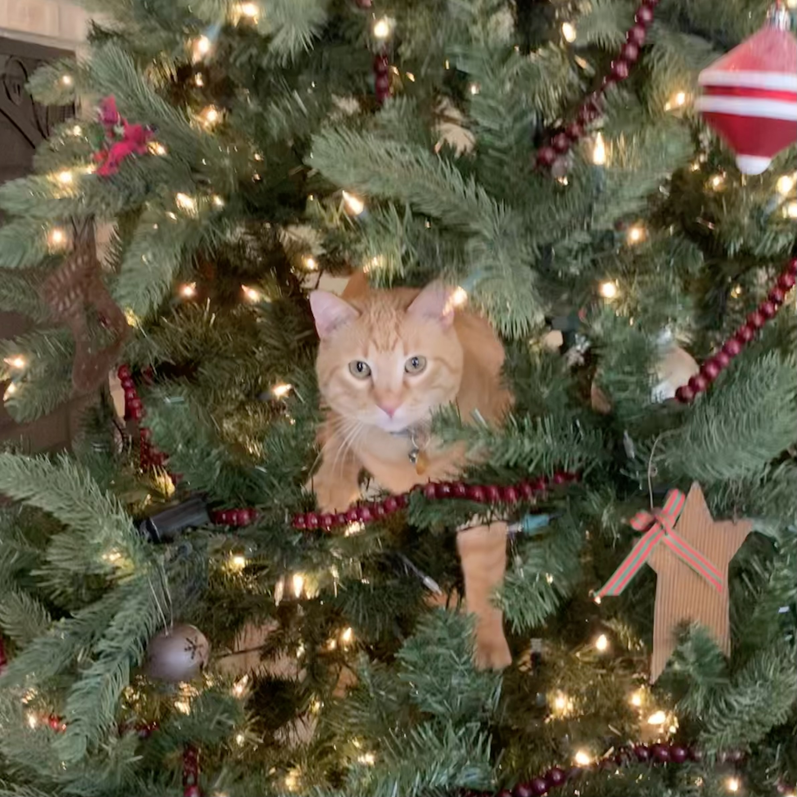
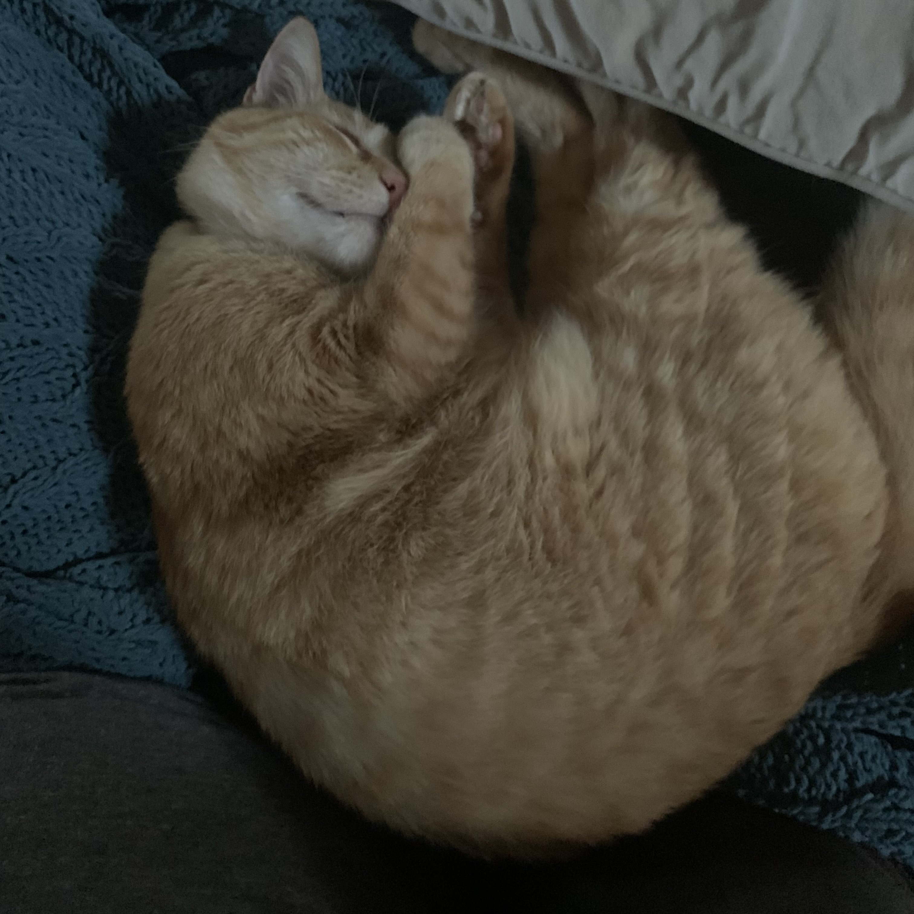
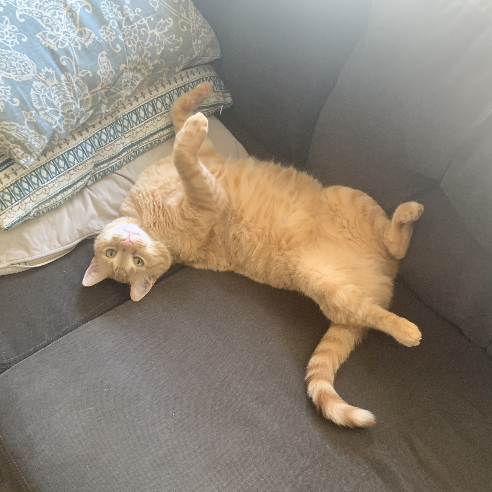

[Return Home](../../README.md)

## Cat Alarm (8/2022)

### Problem:
My cat is a nosy fellow. Literally. He uses his nose to open my door all the time. He can open doors through a series of acrobatics, making almost every room available to him. Sometimes, I'm working on a delicate project or I'm out of town, and he sneaks in while I'm gone and ruins everything.

 

### Solution:
I created an alarm system that would scare away my nosy cat whenever I didn't want him in my room.

  

**Details:**
This was the first mechanical system I designed with my 3D printer; before then, everything had been static parts. It was also my first time combining 3D prints with other materials, because I used wooden skewers as rails for the marbles to slide along.

**Challenges & Solutions:**
- **Challenge: I wanted to make a loud noise to scare him, but not deafen him**
    - Solution: Have the mechanism drop marbles onto the carpeted floor from a significant height.
- **Challenge: I didn't want the mechanism to go off too early or by accident** 
    - Solution: Perfectly size the arm that attaches to the door so the marbles wouldn't fall until the door was significantly cracked open.
- **Challenge: I didn't want to hit my cat in the head** 
    - Solution: Put the alarm on the side opposite of where his head would be, as close to the wall as possible while still letting the mechanism work.

#### Conclusions:
This is perhaps the silliest of my inventions. It only took about a month before he stopped trying to get into my room at all, so I'd call this a success.

Congratulations on reading this deep into my application! I've put lots of work into this documentation, so I truly appreciate you coming this far. If you like what I do in these mini-projects, consider checking out the other, larger projects pinned on my GitHub account. In the meantime, here are some more pictures of my cat:

   

---
####
All associated files and images can be found [here](./)
