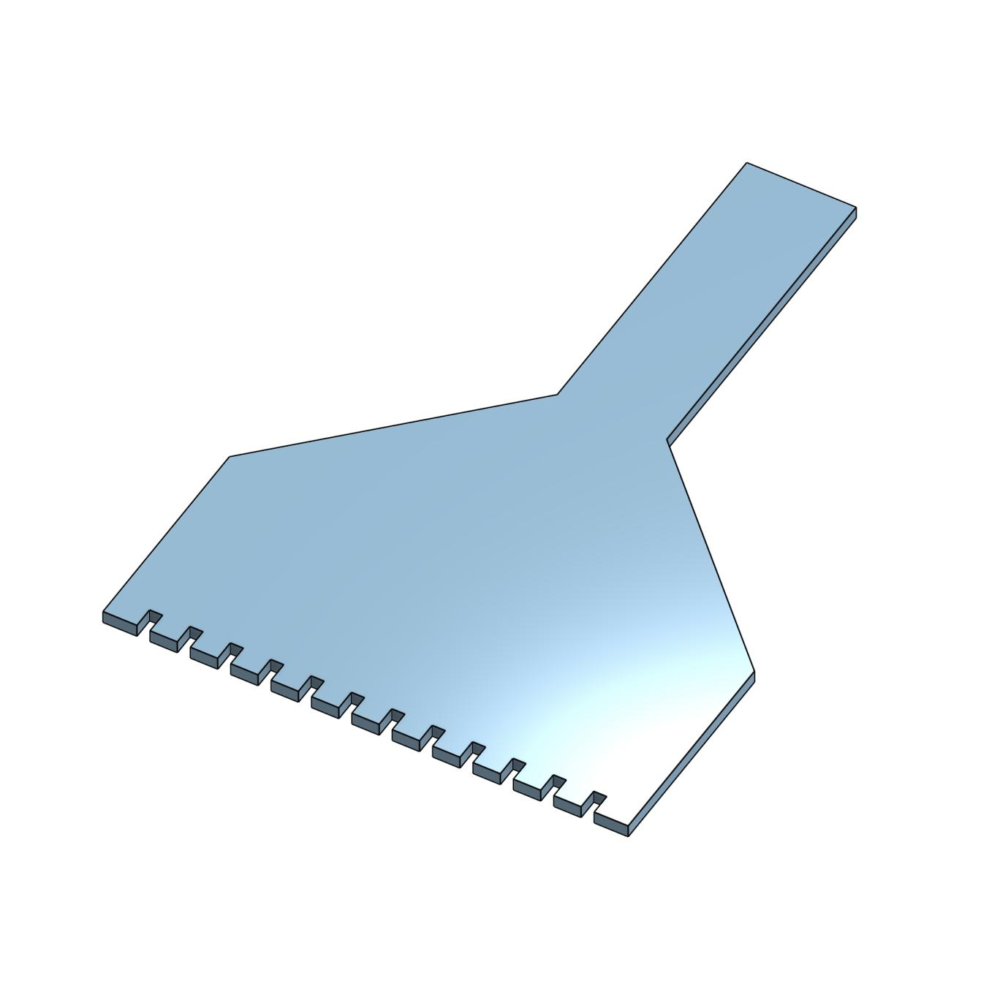

[Return Home](../../README.md)

## Diamond Puzzle Scraper (12/2022)

### Problem:
My friend and I liked to do diamond puzzles together to relax, which involved lining up tiny plastic diamonds on a small alignment device so we could use a specialized tool to grab rows of diamonds at a time. The problem was, removing the diamonds from this alignment device was exceedingly difficult because of small electric charges that made the plastic bits stick together.

 

### Solution:
I created a specialized raking tool that let me quickly clear all the diamonds from the alignment boards.

  

**Details:**
I tried to make this design completely flat because I only had about one hour to design and print it (I had the idea one day when my friend was at my place, and I was trying to get it made before they had to leave). I was successful and, as a result, it was perhaps the quickest engineering project I had done up until that day.

**Challenges & Solutions:**
- **Challenge: The alignment board had ridges on it that were high enough for diamonds to slip under something scraping the top** 
    - Solution: Add small holes in the scraper design that allow the scraper to reach inside the areas between the ridges.
- **Challenge: The bottom of the alignment board was tapered**
    - Solution: Make the scraper slightly smaller so that it could be easily rotated to reach the diamonds in the tapered section.
- **Challenge: The tool was fairly small and hard to grip onto** 
    - Solution: Add a makeshift grip made of masking tape. Adding a grip to the model itself would have made printing it without supports rather difficult and would have upped my printing time by an order of magnitude, so I went with a jerry-rigged solution.

#### Conclusions:
This thing worked great. I made some copies of this tool for my friends at school. If I had been desperate enough, I probably could have sold this as a product back when diamond puzzles were a frenzy on TikTok.

---
####
All associated files and images can be found [here](./)
