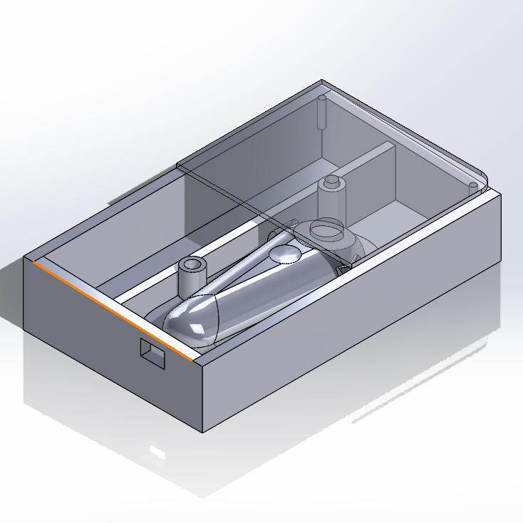

[Return Home](../../README.md)

## Kindle Page Turner (4/2024)

### Problem:
When playing bass in my school's musical pit orchestra, I was unable to reach my Kindle to swipe to the next page. This was making me miss important bits of music and sometimes get lost.

 

### Solution:
I made a foot-activated page turner that would turn the pages for me hands-free, allowing me to read my music with little inconvenience. 

  

**Details:**
I looked for days, but there was no pre-made solution for this anywhere online. The specific problem was, my Kindle didn't work with Bluetooth page-turners; the only way to go to the next page was to physically tap the screen. So what I ended up doing was I took a premade screen-tapping transmitter/receiver tool and made a foot-pedal enclosure to surround it.

**Challenges & Solutions:**
- **Challenge: Foot pedals had to line up with buttons on internal transmitter** 
    - Solution: Create scale model of transmitter body to ensure buttons would line up.
- **Challenge: Foot pedals had to be able to move linearly up/down so internal transmitter buttons could be pressed**
    - Solution: Make pedals only secured by gravity. Create key/hole supports that keep the pedals aligned in XY plane but allow free movement in Z direction.
- **Challenge: Internal transmitter had to be able to be charged** 
    - Solution: Create exterior hole that allows a charging cable to be passed through. Also make the transmitter completely removable/secured with only rubber bands in case I ever need to take it out.

#### Conclusions:
This is perhaps the most used tool I've made. I've converted most of my music to digital copies, and this foot pedal lets me skip to the next page completely hands-free. If I were to do this again, I'd buy a second transmitter/receiver and place a screen-tapper on the other side of the Kindle, to allow me to be able to turn backwards to previous pages.

####
All associated files and images can be found [here](./)