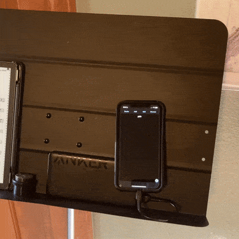
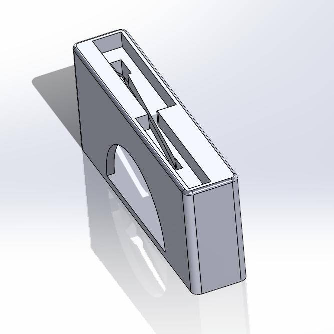
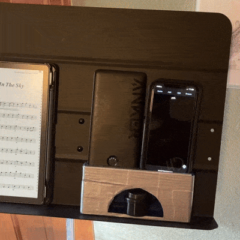

[Return Home](../../README.md)

## Music Stand Phone Holder (4/2024)

### Problem:
Our drama director decided to schedule rehearsal week for the musical the same week as the SAT. I had hours upon hours of rehearsal in place of SAT study time, but I had problems and flashcards I needed to study using Anki regardless. The problem was, I didn't have a good way to keep my phone upright, charged, and accessible at the same time, all while sitting on my music stand.

 

### Solution:
I created a stand that would allow my phone to remain charged with the screen on for hours at a time while in the upright position.

  

**Details:**
This was a bit of a silly project; I knew it probably would have been easier to just buy an L-shaped cord for my phone online, but I wanted an excuse to use my 3D printer again.

**Challenges & Solutions:**
- **Challenge: My phone's cord needed to be able to fit into the stand without having to feed it through tiny holes** 
    - Solution: I added a diagonal slit into the stand that was large enough for the cord to fit through, so the phone and charger could be slid on and off the stand without complication.
- **Challenge: My charging bank was button-activated**
    - Solution: I arranged the system so that the battery bank's button was accessible.
- **Challenge: My stand had limited space, and I still needed a place to store things like my bass rosin** 
    - Solution: I made the interior of the stand hollow to function as extra storage space.

#### Conclusions:
I completely fumbled the 3D printing side of this one, and the result was a ton of duct tape. I used big layer heights because I didn't want the print to take 3 days, but I forgot to add extra material to account for that. So, layer adhesion was nonexistent and, upon dropping it, it snapped in two. But I needed to use it the very next day, so I taped it up as a temporary solution... but never got around to making a non-temporary solution.

---
####
All associated files and images can be found [here](./)