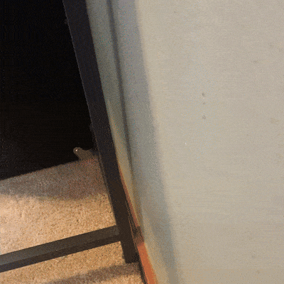
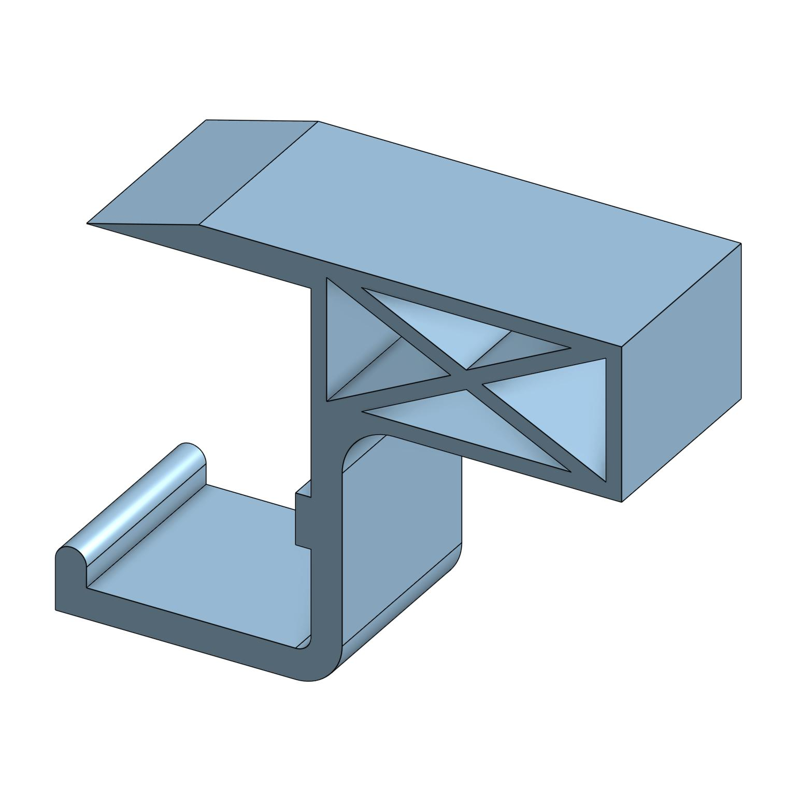

[Return Home](../../README.md)

## Side Table Stabilizer (7/2022)

### Problem:
I was given this small side table for use in my bedroom by my grandmother, who bought it at a garage sale, then decided she didn't like how thin it was. I assembled it and put it in my room, only to discover that the trim on my wall let the table wobble much more than I was comfortable with.

 

### Solution:
I built a plastic stabilizer that would protect my wall from the table smashing into it, while also keeping the table secure so items on top of it wouldn't fall off.

  

**Details:**
This was my very first 3D printing project that I did on my own! And honestly, it might have been the one with my favorite design. It looks like a genuine product someone would use, and I'm quite proud of it despite its limited use or innovation.

**Challenges & Solutions:**
- **Challenge: The table didn't have a good surface for taping or gluing** 
    - Solution: Make the clip snap on and use the tension in the plastic to hold it in place.
- **Challenge: The table had a fairly complicated profile on its edge because of the metal bar underneath it**
    - Solution: Buy a $15 pair of calipers and measure every dimension as precisely as possible, then add some fairly complex geometry to the model to ensure a tight fit.
- **Challenge: Plastic was harder than my walls** 
    - Solution: Add a small piece of foam padding on the end of the print so that it doesn't scratch away paint on my walls.

#### Conclusions:
I slipped this thing onto the table fresh off of the 3D printer, and the little *click* of it securing itself was unbelievably satisfying. I must admit that the padding on the ends was added *after* the spots on my wall showed paint cracking off, but that's nothing a steady hand and some colored pencils can't fix.

---
####
All associated files and images can be found [here](./)
