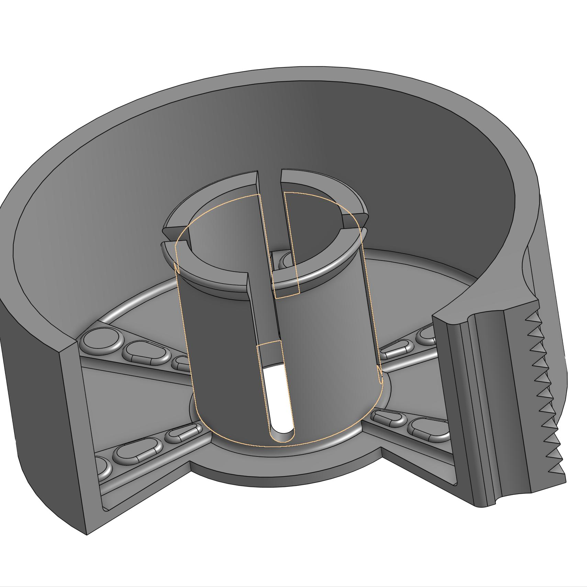

[Return Home](../../README.md)

## Tape Dispenser (3/2022)

### Problem:
Traditional plastic tape dispensers fell apart and shattered in my backpack.

 

### Solution:
I built a custom tape dispenser that was heavy-duty and had a more convenient shape.

  

**Details:**
This was done for a school project where we had the freedom to design whatever we wanted. Regardless, I didn't count this as my first project because I didn't print it myself; my school did.

**Challenges & Solutions:**
- **Challenge: The tape dispenser needed to be able to cut tape** 
    - Solution: Incorporate a serrated edge into the design that mirrors commercial tape dispensers.
- **Challenge: The tape dispenser needed to have as little sticky side exposed as possible**
    - Solution: Make the serrated edge as close to the roll of tape itself as possible.
- **Challenge: The tape inside the dispenser had to be able to spin freely while remaining securely attached** 
    - Solution: Make a ridged, flexible inner axle for the tape to spin around while remaining attached.

#### Conclusions:
This worked decently; I just didn't find myself using it very often. There were a few flaws in my design, however: 1) the serrated edge wasn't serrated enough (you could probably see that it took excess effort to tear off the tape in the demo); 2) the inner axle didn't have enough clearance, so I ended up snapping off one of the panels so it could spin more freely.

---
####
All associated files and images can be found [here](./)
