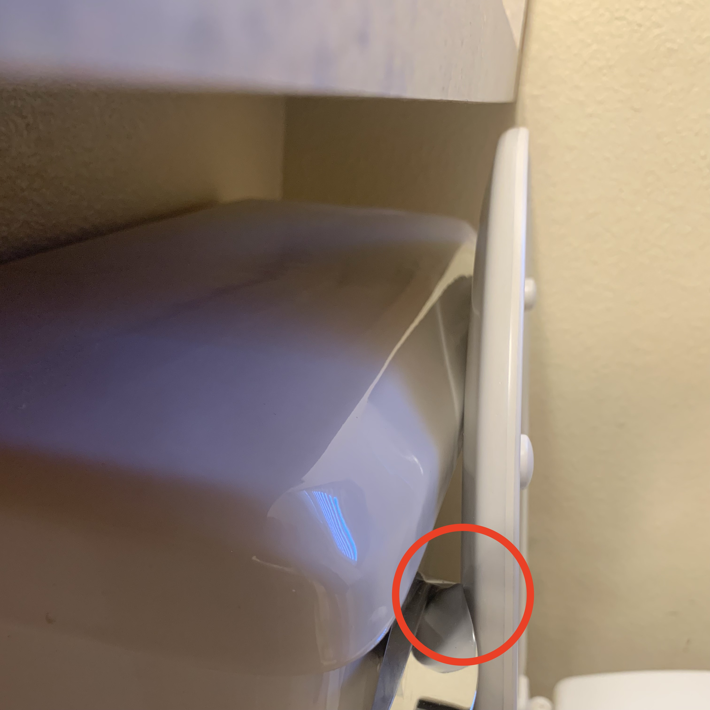
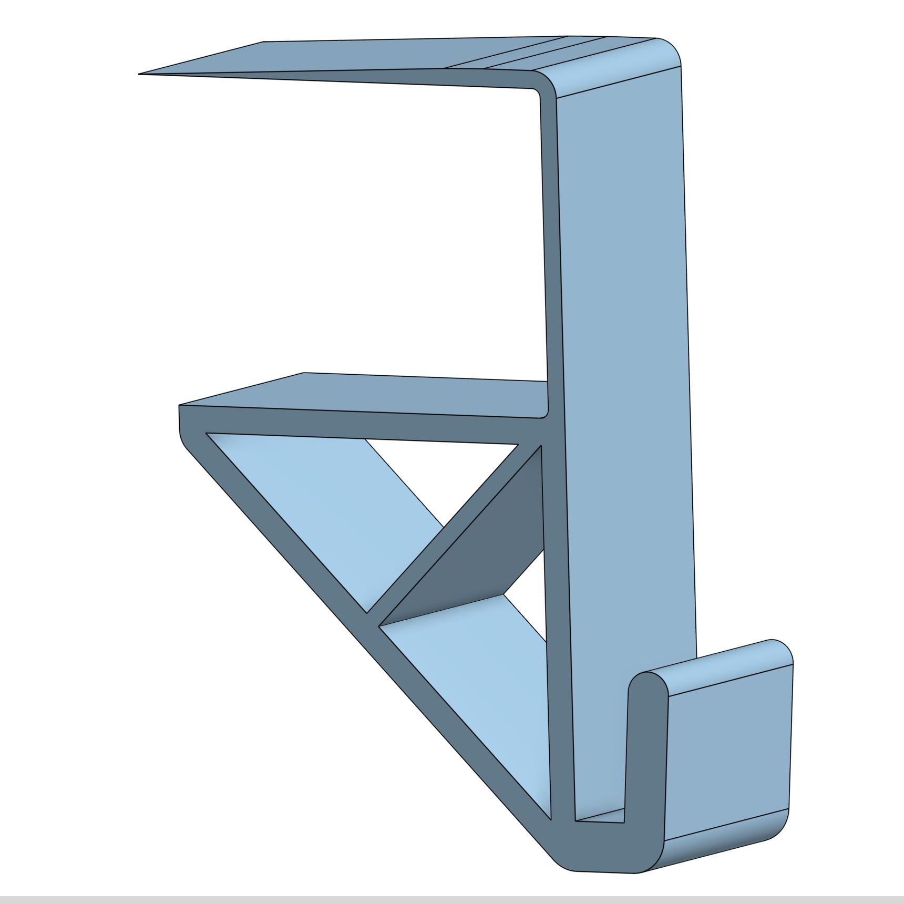
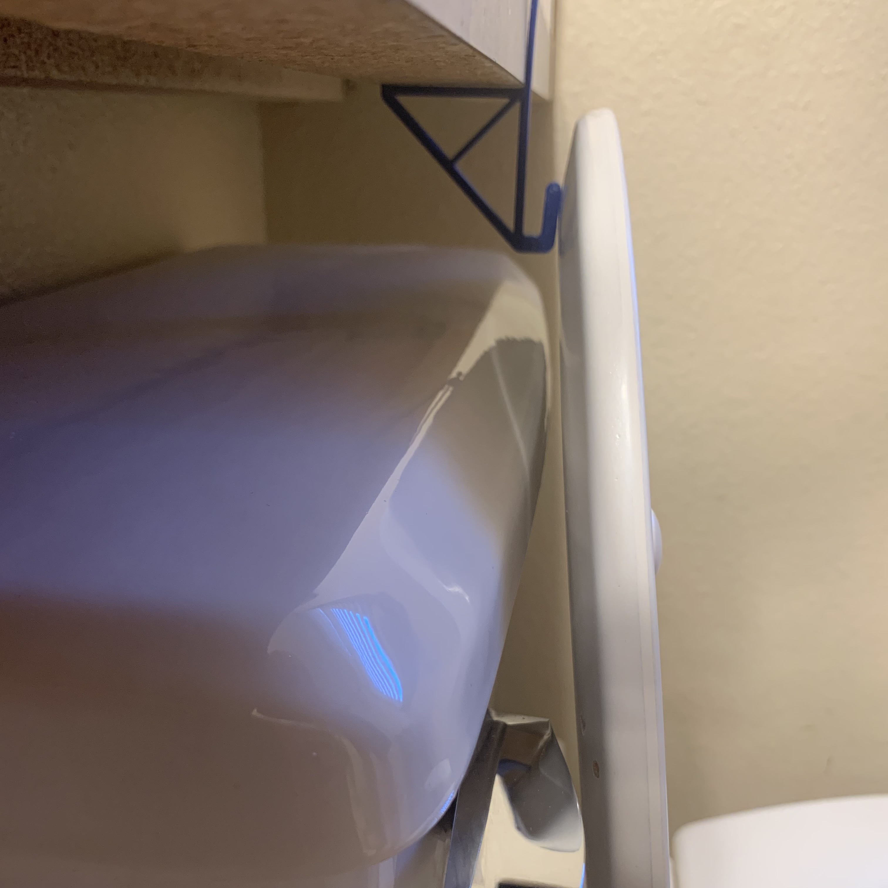

[Return Home](../../README.md)

## Toiler Lid Spacer (2/2023)

### Problem:
The lid on one of our toilets will occasionally pin itself against the handle, causing a case of *infinite flushing*.

 

### Solution:
Create a small spacer that will keep the lid off of the handle.

  

**Details:**
We accidentally bought the wrong type of handle for this toilet when we replaced an old broken one. If we simply purchased a handle that wasn't so blocky, then this problem wouldn't have existed.

**Challenges & Solutions:**
- **Challenge: Porcelain is too smooth to glue anything to** 
    - Solution: Make the spacer attached via friction to the countertop above the tank.
- **Challenge: The spacer needs to support the weight of the lid**
    - Solution: Add a cross-brace that lets the spacer use the underneath of the countertop as support.
- **Challenge: The spacer needs to be flexible enough to bend out of the way when a person puts their weight on the lid** 
    - Solution: Make it fairly thin and bendy so that a toilet user wont snap it in two.

#### Conclusions:
This spacer works quite well, and we haven't had the problem of infinite flusing since. One thing I'd change about the model is I'd make it have a much tighter fit onto the countertop, because it tends to slide off-center after several uses, being put in a position where it's unable to support the lid.

---
####
All associated files and images can be found [here](./)