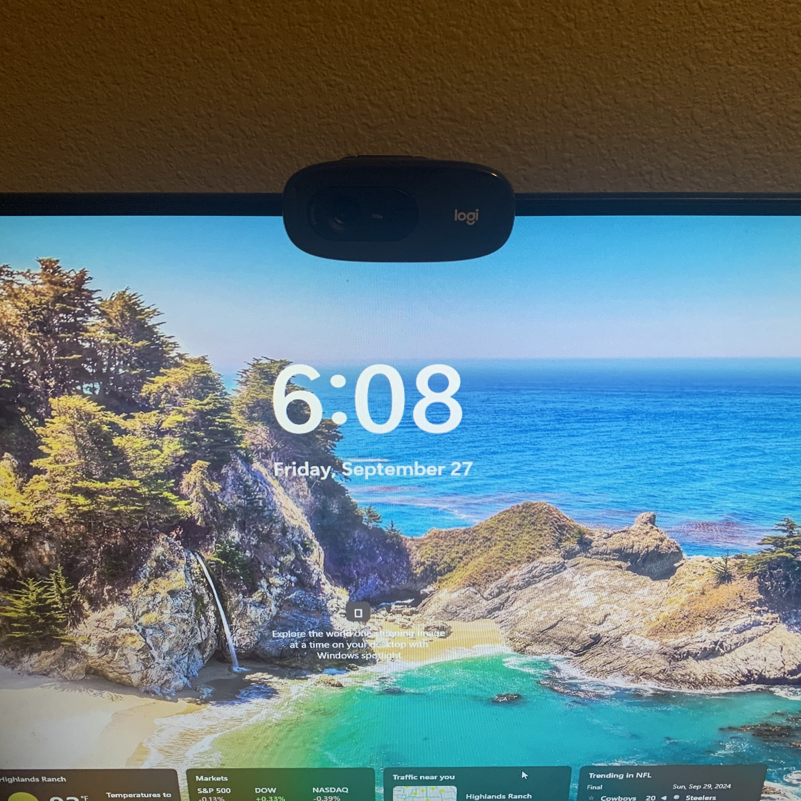
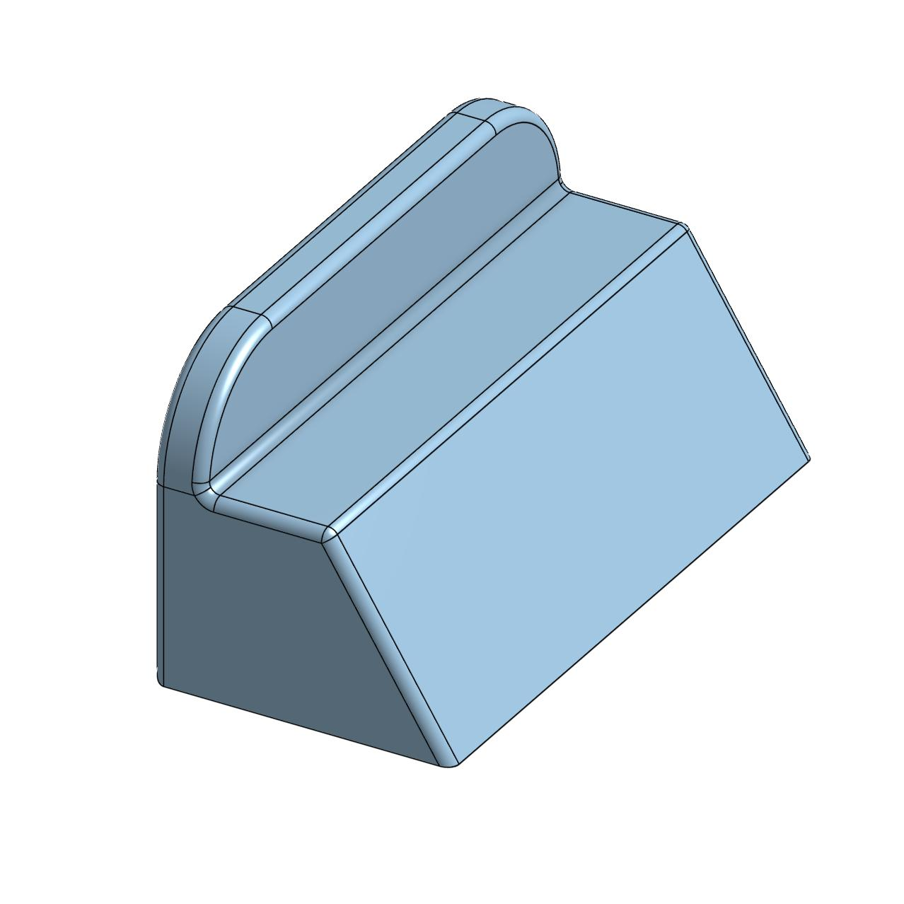
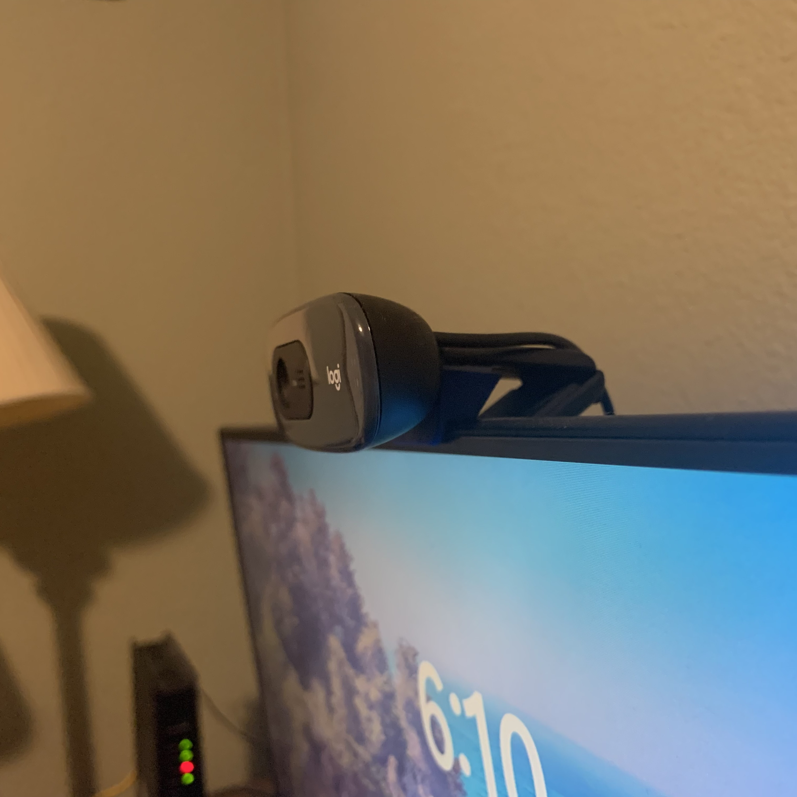

[Return Home](../../README.md)

## Web Cam Booster (5/2023)

### Problem:
I got new a remote job at DupperAnalytics, and I needed a webcam. Upon buying the cheapest webcam I saw, I found that it covered up a good 1/2-inch of my screen. This is quite irritating because that's where all my browser and VS Code tabs are located.

 

### Solution:
Create a small spacer that will lift the webcam higher off of my screen's bezel, significantly reducing its interference.

  

**Details:**
I'm not sure why this webcam had such an obvious design flaw in the first place. This tech has been around for decades; how have companies not implemented better practices yet?

**Challenges & Solutions:**
- **Challenge: The Webcam's attachment is done through tension between the front and back parts of the assembly** 
    - Solution: Make a flat surface at the edge of the mdoel that allows the front bezel to be used as a surface for tensioning.
- **Challenge: The spacer needs to attach to the Webcam directly; friction fits wont work here**
    - Solution: Taper out one end of the spacer so I can attach a piece of sticky foam to keep it in place.
- **Challenge: The Webcam still needs to be able to pivot around its hinge** 
    - Solution: Make the spacer as sleek as possible on the front end so the camera has room to move about.

#### Conclusions:
It works. I often forget it's even something I made; it seems so natural to the webcam's design and function. There's not much I'd change here, perhaps because it's such a simple model already.

---
####
All associated files and images can be found [here](./)