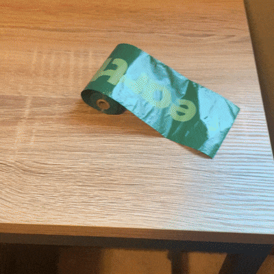
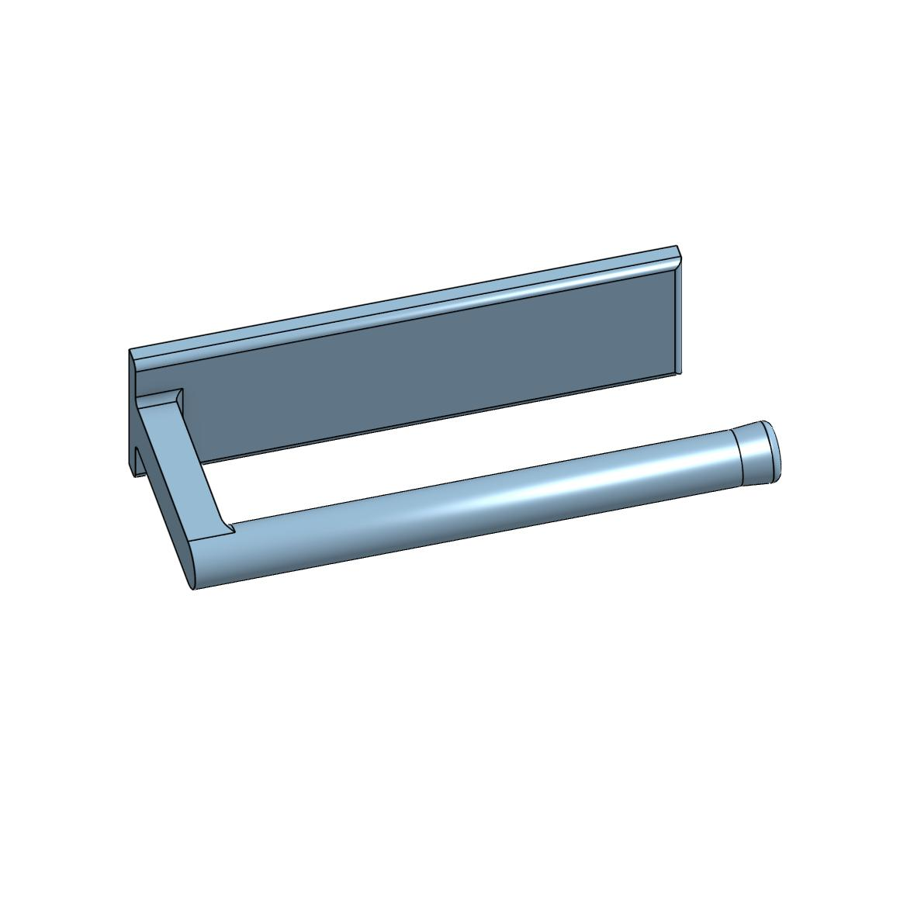

[Return Home](../../README.md)

## Dog Bag Dispenser (11/2023)

### Problem:
We buy these rolls of bags, and each time we take the dog on a walk we bring one with us. The problem is, it's quite difficult to dispense a bag one-handed from the roll when you're wrangling a crazy dog with the other hand.

 

### Solution:
Create a wall-mount for the bags so that I can dispense them one-handed.

#### Conclusions:
This model and concept were very simple, but this was the case where the problem itself wasn't very hard on its own. Especially as my dog ages, he gets less and less energetic and grabbing a bag for the walk has become trivially easy.

---
####
All associated files and images can be found [here](./)