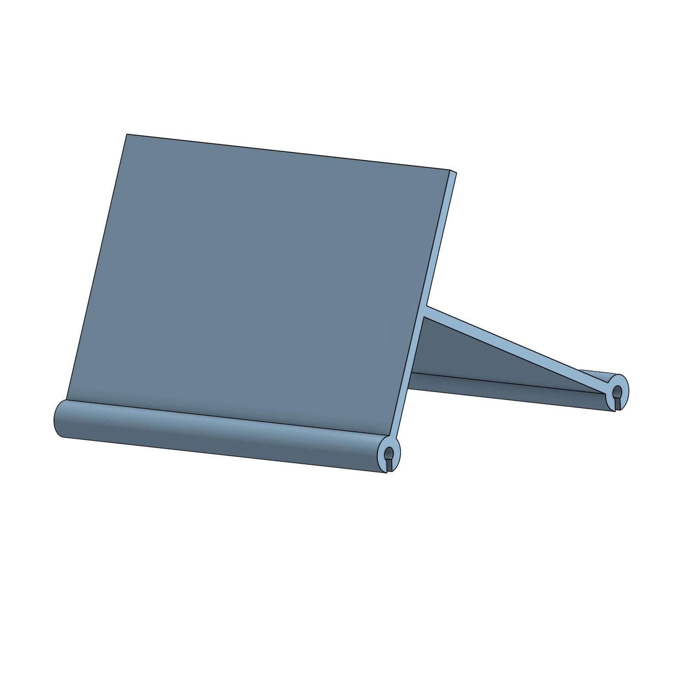

[Return Home](../../README.md)

## Marching Band Lyre (8/2023)

### Problem:
I play the largest bass drum in our marching band, and while I'm doing parades and playing the football stands it's helpful to have sheet music to reference. The problem is, I don't have any way to hold sheet music secure while wearing the drum.

(show music balanced precariously on bass drum)
 

### Solution:
Design a custom lyre that can moun itself to the existing brackets on the drum.

  

#### Conclusions:
Again, as is the theme with these design-only projects, I simply found an easier solution: memorize the music. There's also some pre-made lyres for about $10, so making my own wouldn't have saved me much anyways.

---
####
All associated files and images can be found [here](./)