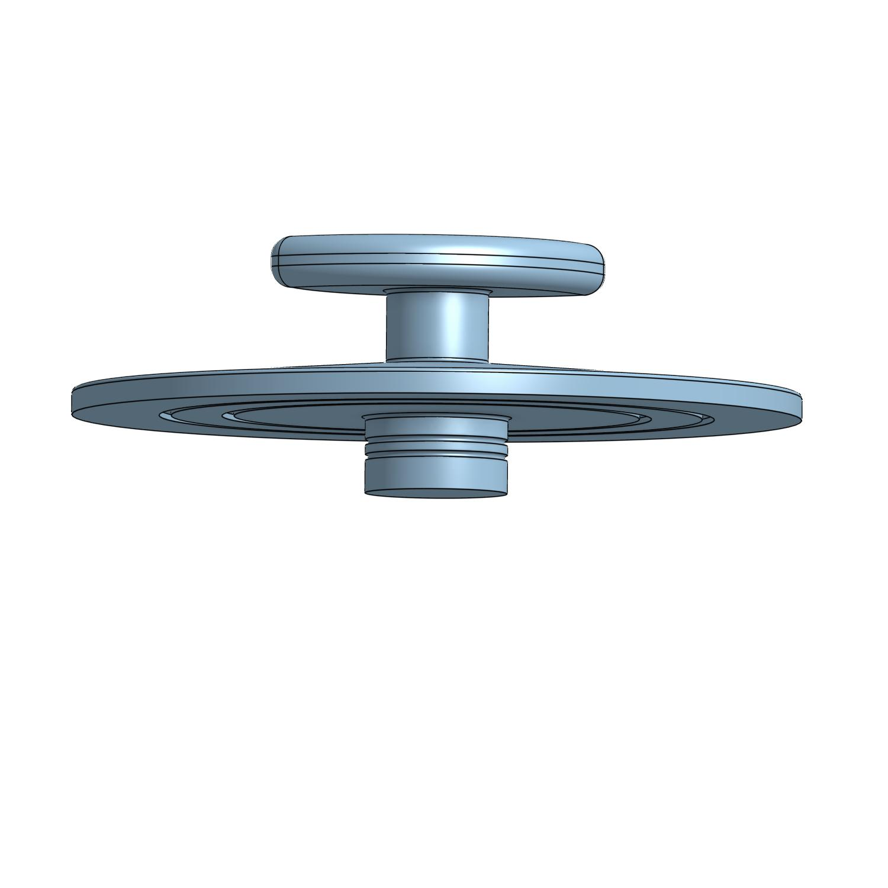

[Return Home](../../README.md)

## Sandbox Plug (2/2024)

### Problem:
There's this bin at my church that we often fill with sand to make a sensory experience for the children that need it. The problem is, we lost the plug years ago and currently the only thing keeping sand in is a ton of tape.

(show sandbox with red circle)
 

### Solution:
Build a new plug that fits the hole perfectly. Add o-rings for a water-tight seal if needed.

#### Conclusions:
Yet again, we ended up just finding an easier solution. We bought a rubber test-tube plug for <$1 that worked just fine.

---
####
All associated files and images can be found [here](./)